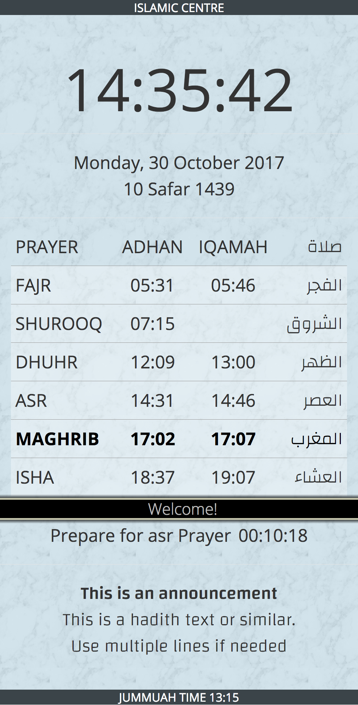
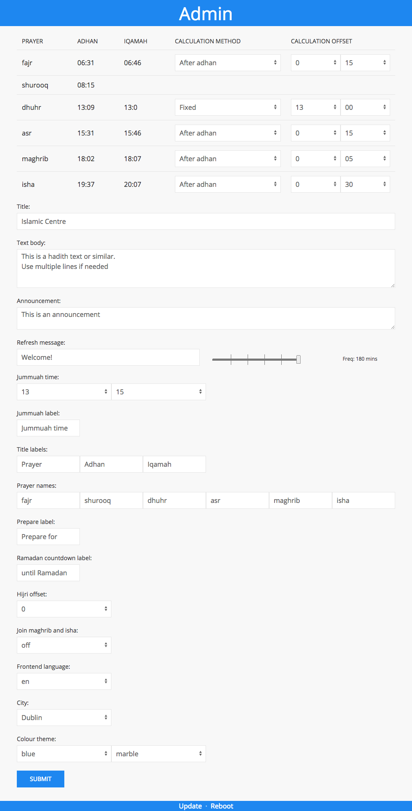

## This app is superceeded by prayer-timetable-react app

### New app is more robust and completely rewritten in React JS. This version is still usable if you need standalone app with admin interface built in. New app available at https://gitlab.com/ench0/prayer-timetable-react

# Prayer timetable

Muslim prayer timetable app for deployment on Raspberry Pi. It is meant to be used on public displays to show your local community's prayer times. Can be used in masjids, mosques or even home. Optimised for Full HD screens. NodeJS and Express powered, using UIKit for styling, Pug for template engine, Moment.js for time manipulation and more. Please note that this is at alpha stage and built specifically for my own needs.

This software is provided as-is, with no warranty of any kind. I provide it for free and do not expect and ask for any compensation. What's more, I will help you setup your own presentation screen and even install for free, but you will cover the postal bills in case you send me your own Raspberry Pi for setup.

Instructions on full deployment coming soon, for now you're on your own. :)

## Quick Start

### Standalone app:

    git clone https://github.com/ench0/prayer-timetable

### Express module:

    require("prayer-timetable")

Router file:

    router.get('/timetable', function(req, res, next) {
    res.render('timetable', { title: 'Timetable', settings: settings, timetabledef: timetabledef, settingsdef: settingsdef });
    });

Home page: your_IP:3000

Main timetable display: your_IP:3000/timetable

Mobile view: your_IP:3000/mobile

Admin area: your_IP:3000/admin

Default username/password for admin area: admin/admin

To manually change the password, use:
    npm i -g htpasswd
    htpasswd -Bc ./config/user.pass admin

Password can be changed from the admin area as well. 

## Features
* Prayer times
* Jamaah times
* Jamaah calculation offsets/methods
* Admin area
* Basic user authentication
* Password change
* Automatic refresh of frontend after backend/admin update
* Git updates
* Next prayer countdown
* Jummuah notification
* Refresh bar
* Themes
* Announcements/messages
* Mobile view/app
* Hijri dates
* Hijri offset
* Next day starts after isha
* 2 frontend languages

## How can you help
The timetable app currently contains timetables and language packs for Dublin and Rotterdam. If you like your city/language to be included, please contact me and send your own timetable. Use examples from other cities to figure out the JSON format. You are responsible for accuracy of the data.

## Tools and libraries used
* NodeJS
* Express
* Moment JS, Moment Timezone, Moment Hijri
* UI Kit
* Pug
* Reload
* JQuery
* String
* Shell JS
* Nodemon for development
* OpenSans fonts
* Changa fonts
* Freepik images for backgrounds
* http-auth + bcrypt

## Screenshots

Frontend             |  Admin area
:-------------------------:|:-------------------------:
  |  
